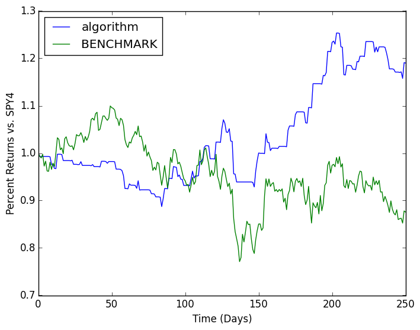

# AlgoTrader Research Project

Demo version released 11/10/2015, which supports backtesting with daily bars with swappable strategies, as well as clustering stocks to use as training data.

Example output of the NeuralNet trading on the SPY, with SPY as benchmark:

### Usage

Running master tests: 

  	$ python runner.py 

optional arguments:

	-h, --help            show this help message and exit
	-n {1,2,3,4}, --strategy_num {1,2,3,4}
	-e EPOCHS_NUM, --epochs_num EPOCHS_NUM
	-c {1,2,3,4,5,6,7,8,9,10,11,12,13,14,15,16,17,18,19,20,21,22,23,24}, --cluster_num {1,2,3,4,5,6,7,8,9,10,11,12,13,14,15,16,17,18,19,20,21,22,23,24} 
	-g, --graph_clusters  Graph clusters.
	-l, --graph_elbow     Graph elbow method for clustering.

Verify Quantopian Zipline framework:

    ./manager/example_backtest $ run_algo.py -f movingAverages.py --start 2000-1-1 --end 2014-1-1 --symbols AAPL -o movingAverages_out.pickle
    ./manager/example_backtest $ python readfile.py

### Dependencies

* NumPy, SciPy, scikit-learn (use Anaconda): http://docs.continuum.io/anaconda/install
* Lasagne (requires Theano): http://lasagne.readthedocs.org/en/latest/user/installation.html
* Quantopian Zipline (backtesting): https://github.com/quantopian/zipline
